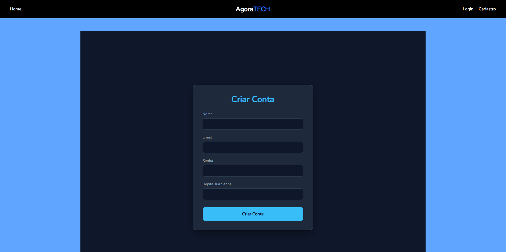
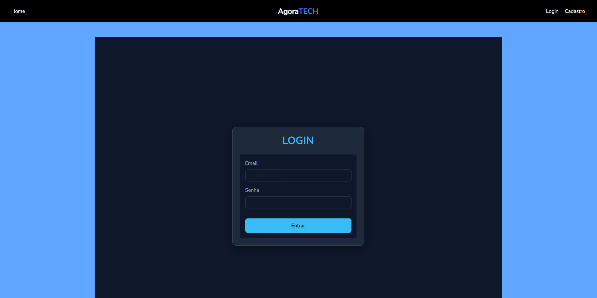
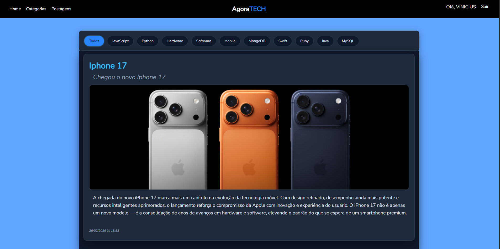
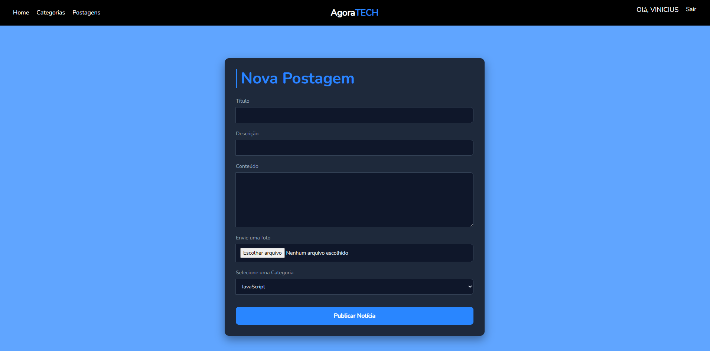

AgoraTech, um site de notícias sobre tecnologia.

Tecnologias usadas:

Javascript
Node.JS
MongoDB

Módulos e frameworks usados na construção:

Express.JS, Mongoose, Handlebars, Passport.JS, Body-Parser, Connect-Flash, Dayjs

O Site consiste em postagens sobre tecnologia, abordando os mais diversos assuntos sobre desenvolvimento de sistemas e afins, tendo como base categorias que podem ser adicionadas apenas por usuários ADMIN, e postagens que também só podem ser adicionadas por ADMIN.
  As postagens tem como base as categorias, onde você pode filtrar as postagens pela barra de navegação entre categorias.
  O APP inclui um sistema de criptografia de senhas com Passport, para o usuário ter mais segurança no acesso ao Blog.
  Usando o Handlebars, temos as barras de navegação entre categorias, barra principal, e postagens sendo criadas dinamicamente com conexão ao banco de dados.

Aqui temos algumas imagens de como está o site atualmente, tendo em vista que as páginas foram feitas sem muito comprometimento com o design, mas, isso será melhorado conforme irei aperfeiçoando o projeto.

